# Отчёт по лабораторной работе 2

## Практика 1 — GET-запросы через Postman

Тестирование API Звёздных войн (https://swapi.dev/) с помощью Postman.

### 1.1. species — name=droid, average_lifespan=?

**Ответ:** `average_lifespan = "indefinite"`

### 1.2. starships — name=Millennium Falcon, crew=?

**Ответ:** `crew = "4"`

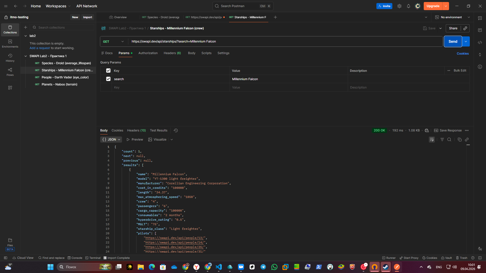

### 1.3. people — name=Darth Vader, eye_color=?

**Ответ:** `eye_color = "yellow"`

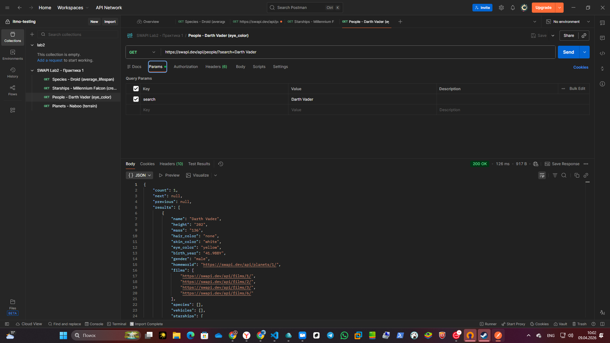

### 1.4. planets — name=Naboo, terrain=?

**Ответ:** `terrain = "grassy hills, swamps, forests, mountains"`

---

## Практика 2 — Получение по id и команда cURL

### 2.1. Фильм с id=5 — название и дата выхода

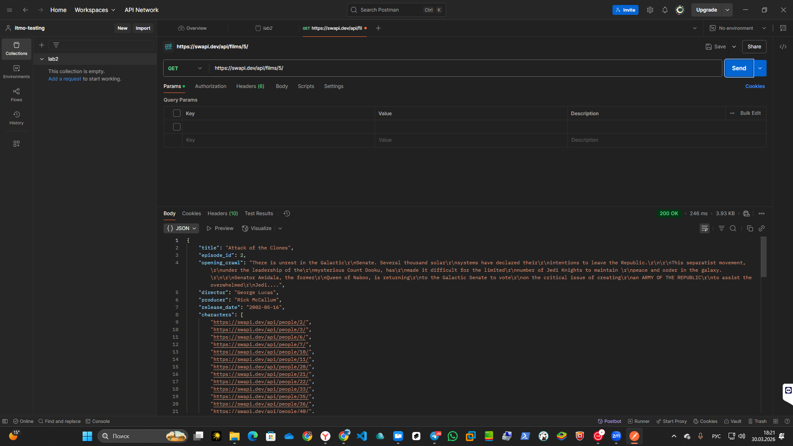

### 2.2. curl-запрос на получение starship с id=3

Запрос в Postman:

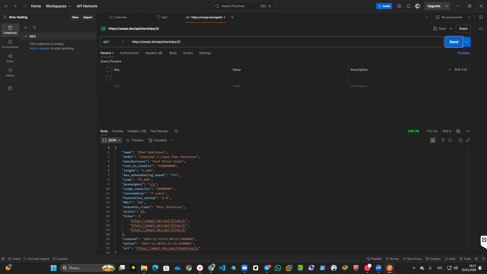

Выполнение curl-запроса в терминале (команда + вывод):

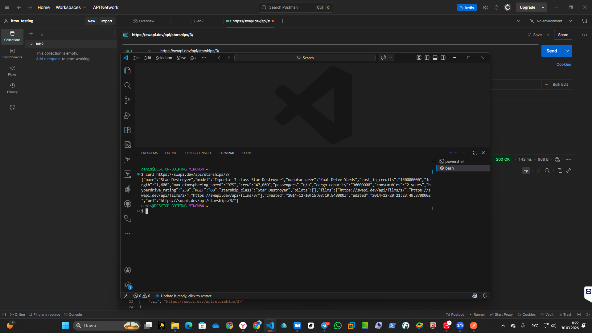

---

## Практика 3 — Поиск через ?search=

### 3.1. Поиск космического корабля Star Destroyer через ?search=

На скриншоте видны: метод (GET), адрес, параметры запроса (search=Star Destroyer), статус-код (200 OK) и body ответа.

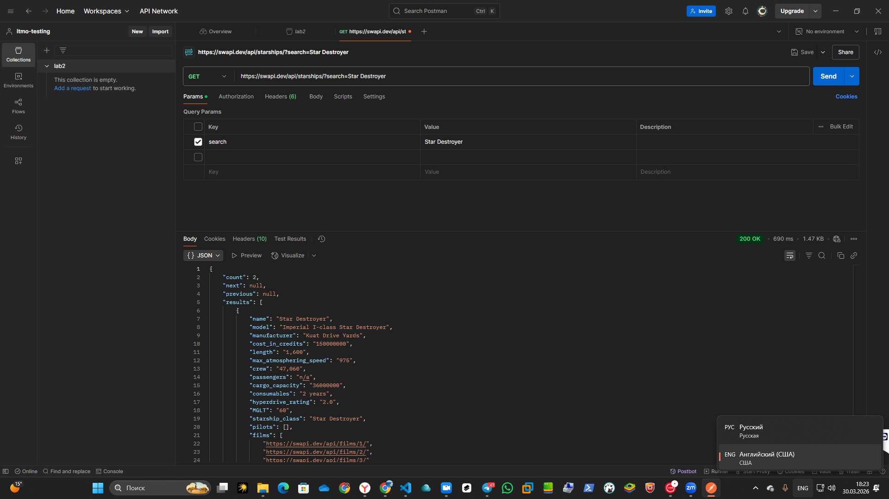

---

## Практика 4 — Postman Console

### 4.1. Вывод кода ответа в консоль через console.log()

Скрипт с console.log для вывода кода ответа:

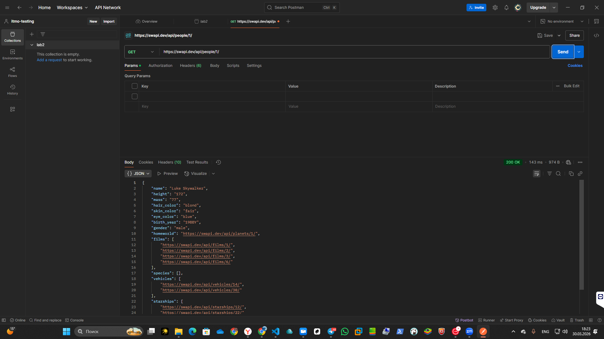

Результат выполнения скрипта:

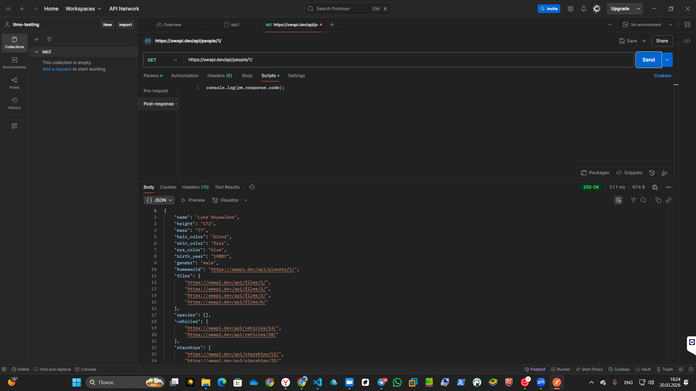

---

## Практика 5 — Insomnia

Тестирование swapi (people) с помощью Insomnia.

### 5.1. Получение данных по людям по id

Сначала запрос GET на https://swapi.dev/api/people/?search=C-3PO для определения id:

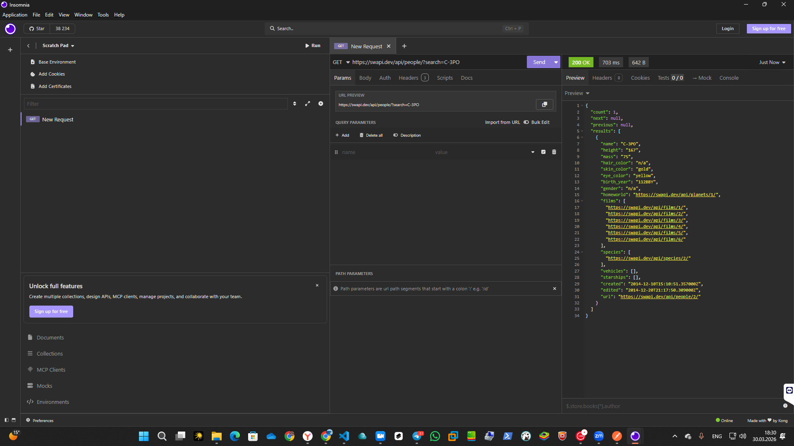

Затем запрос GET на https://swapi.dev/api/people/2/ (C-3PO имеет id=2):

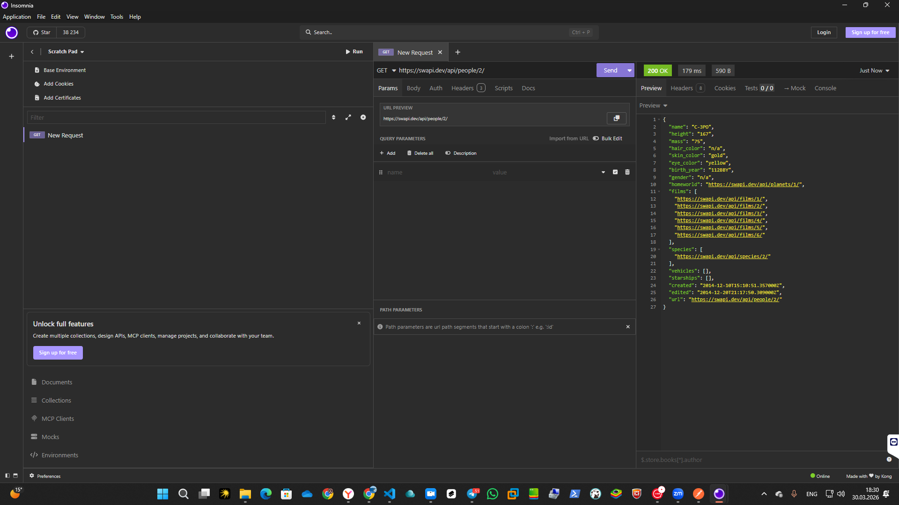

### 5.2. Ошибка 405 Method Not Allowed

Отправка запроса неправильным методом (DELETE) для получения ошибки 405:

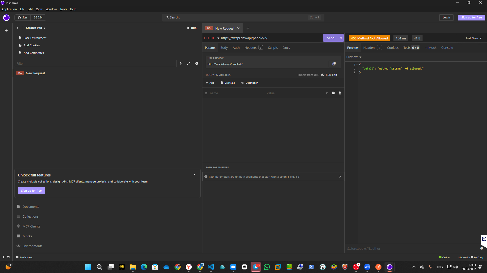

### 5.3. Ошибка 404 Not Found

Отправка запроса на несуществующий ресурс для получения ошибки 404:

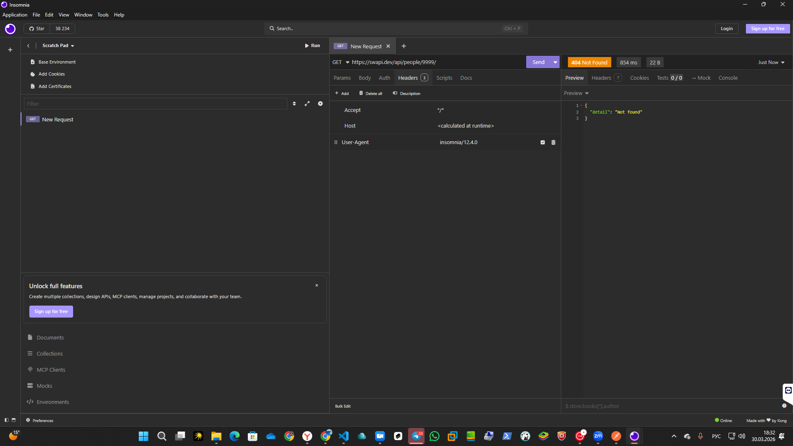

---

## Практика 6 — Swagger

### 6.1. Swagger Editor

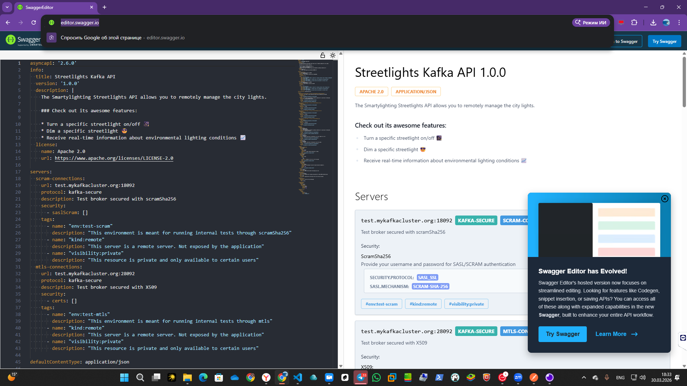

### 6.2. Swagger Petstore — добавление питомца

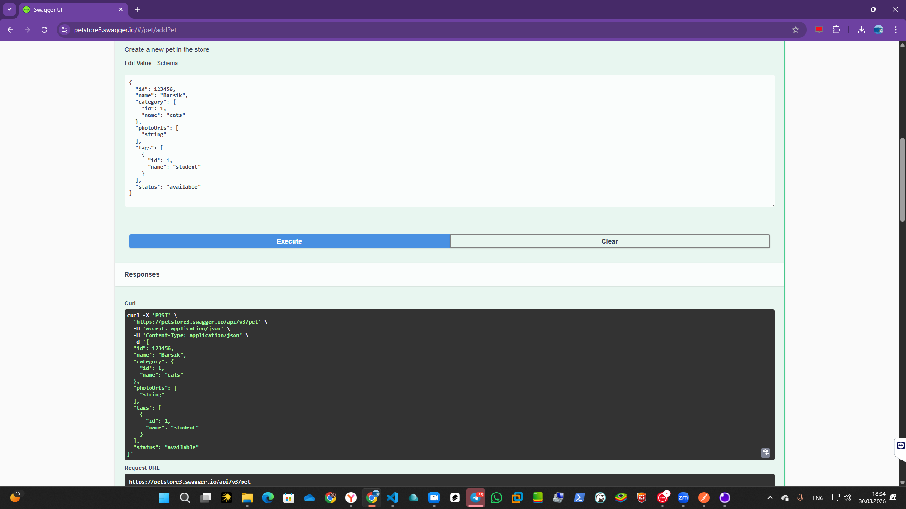

### 6.3. Swagger Petstore — получение питомца по id

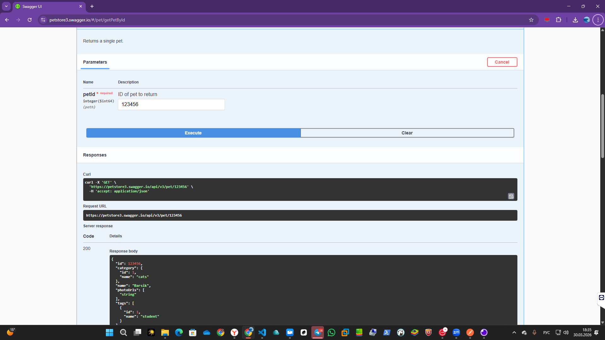
